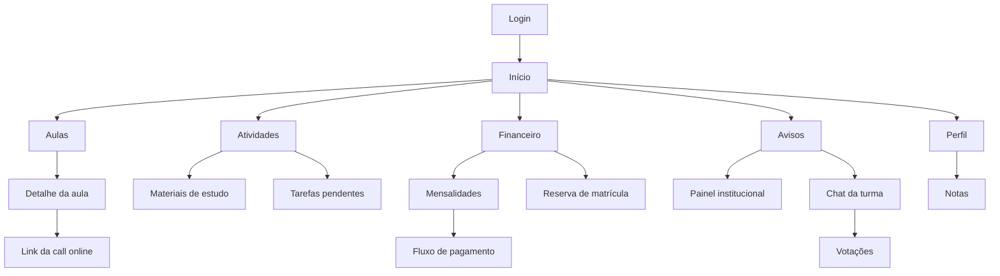
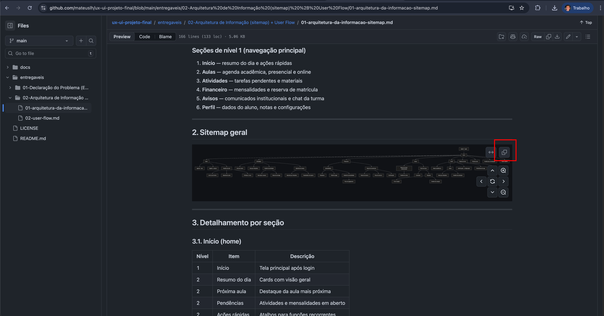

# Aplicativo Acadêmico SATC

Projeto final da disciplina de UX/UI. Protótipo de um aplicativo móvel voltado para estudantes universitários da SATC, com foco em simplificar as tarefas acadêmicas recorrentes do dia a dia.

> **Tagline:** Educação, Tecnologia e Inovação

---

## Sobre o projeto

Os processos acadêmicos atuais da universidade são realizados majoritariamente em um portal web lento e de difícil uso. O objetivo deste projeto é desenhar e prototipar uma experiência mobile rápida, objetiva e orientada à rotina real do estudante, centralizando as ações mais frequentes em poucos fluxos claros.

### Principais funcionalidades previstas

- Resumo do dia com próximas aulas, pendências e avisos
- Consulta e pagamento de mensalidades
- Reserva de matrícula
- Agenda de aulas presenciais e online (com link da call)
- Visualização de notas e desempenho
- Materiais de estudo organizados por disciplina
- Atividades acadêmicas e acompanhamento de entregas
- Painel de avisos institucionais
- Chat da turma com votações
- Notificações push sobre eventos acadêmicos

---

## Stack do protótipo

- **React** — biblioteca principal da interface
- **Vite** — build e dev server
- **Vercel** — hospedagem do protótipo publicado

O código-fonte do protótipo fica isolado na pasta `app/`, com a estrutura padrão do Vite (`app/src/` para o código React). Nada do projeto React vaza para a raiz do repositório, que permanece limpa para documentação e entregáveis.

---

## Mapa de navegação (visão rápida)



> Versão completa do sitemap e dos fluxos detalhados em [`entregaveis/02-...`](entregaveis/02-Arquitetura%20de%20Informa%C3%A7%C3%A3o%20%28sitemap%29%20%2B%20User%20Flow).

---

## Sobre os diagramas (Mermaid)

Todos os diagramas do projeto foram feitos em **[Mermaid](https://mermaid.js.org)**: uma forma de escrever diagramas como texto dentro do próprio `.md`. A vantagem é que o diagrama fica versionado junto do código, é fácil de editar e o **GitHub renderiza automaticamente** quando você abre o arquivo.

### Como visualizar

- **Direto no GitHub** — basta abrir o `.md` aqui no repositório. O diagrama aparece já renderizado junto do texto.
- **No [mermaid.live](https://mermaid.live)** — recomendado para os diagramas maiores (como o sitemap completo), porque o site permite **zoom, pan e etc**.

### Como jogar um diagrama no mermaid.live

1. Abra o arquivo `.md` aqui no GitHub (ex: [`02-user-flow.md`](entregaveis/02-Arquitetura%20de%20Informa%C3%A7%C3%A3o%20%28sitemap%29%20%2B%20User%20Flow/02-user-flow.md)).
2. Encontre um bloco que começa contem o mermaid, e copie.
 
3. Acesse [mermaid.live](https://mermaid.live), apague o exemplo que aparece no editor da esquerda e cole o código.
4. O diagrama renderiza na hora no lado direito — use o mouse para dar zoom, arrastar e navegar em geral.

---

## Estrutura do repositório

```
.
├── docs/                   # Documentação do projeto
│
├── entregaveis/            # Entregáveis da disciplina
│   ├── 01-Declaração do Problema + Persona + Jornada + Usabilidade/
│   └── 02-Arquitetura de Informação (sitemap) + User Flow/
│   ...
├── app/                    # Projeto React (Vite) do protótipo
│   ├── package.json
│   ├── vite.config.js
│   ├── index.html
│   └── src/                # Código React (components, pages, styles)
├── .agent                  # Guia para agentes de IA que mexem no repo
├── LICENSE
└── README.md
```

---

## Documentação

| Documento | Descrição |
|---|---|
| [Visão geral do projeto](docs/01-visao-geral-do-projeto.md) | Contexto, problema, objetivos, escopo, jornada, diretrizes de UX/UI e funcionalidades |
| [Sitemap](entregaveis/02-Arquitetura%20de%20Informa%C3%A7%C3%A3o%20%28sitemap%29%20%2B%20User%20Flow/01-arquitetura-da-informacao-sitemap.md) | Arquitetura da informação do aplicativo |
| [User Flow](entregaveis/02-Arquitetura%20de%20Informa%C3%A7%C3%A3o%20%28sitemap%29%20%2B%20User%20Flow/02-user-flow.md) | Fluxos principais do usuário |

---

## Rodando o protótipo localmente

Todos os comandos devem ser executados de dentro da pasta `app/`:

```bash
cd app

# instalar dependências
npm install

# iniciar o dev server
npm run dev

# gerar build de produção
npm run build
```

O dev server abre por padrão em `http://localhost:5173`.

---

## Deploy

O protótipo é publicado automaticamente na **Vercel** a cada push na branch `main`.

- URL de produção: [ux-ui-projeto-final](https://ux-ui-projeto-final.vercel.app/)
---

## Responsáveis

| Nome | E-mail | GitHub |
|---|---|---|
| Mateus Leal Hemkemeier | [mateuslealhemkemeier@gmail.com](mailto:mateuslealhemkemeier@gmail.com) | [@mateuslh](https://github.com/mateuslh) |
| Carlos Eduardo Bez Fontana | [carloseduardobezfontana@gmail.com](mailto:carloseduardobezfontana@gmail.com) | [@Carloseduardob](https://github.com/Carloseduardob) |

---

## Licença

Ver [LICENSE](LICENSE).
