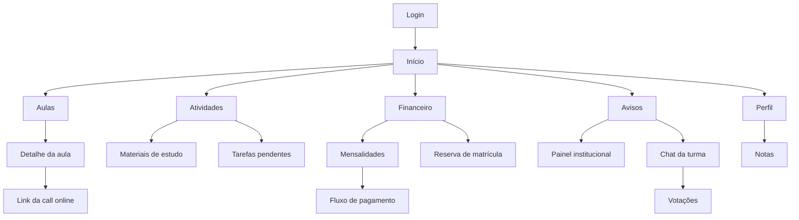

# Aplicativo Acadêmico SATC

Projeto final da disciplina de UX/UI. Protótipo de um aplicativo móvel voltado para estudantes universitários da SATC, com foco em simplificar as tarefas acadêmicas recorrentes do dia a dia.

> **Tagline:** Educação, Tecnologia e Inovação

---

## Sobre o projeto

Os processos acadêmicos atuais da universidade são realizados majoritariamente em um portal web lento e de difícil uso. O objetivo deste projeto é desenhar e prototipar uma experiência mobile rápida, objetiva e orientada à rotina real do estudante, centralizando as ações mais frequentes em poucos fluxos claros.

### Principais funcionalidades previstas

- Resumo do dia com próximas aulas, pendências e avisos
- Consulta e pagamento de mensalidades
- Reserva de matrícula
- Agenda de aulas presenciais e online (com link da call)
- Visualização de notas e desempenho
- Materiais de estudo organizados por disciplina
- Atividades acadêmicas e acompanhamento de entregas
- Painel de avisos institucionais
- Chat da turma com votações
- Notificações push sobre eventos acadêmicos

---

## Stack do protótipo

- **React** — biblioteca principal da interface
- **Vite** — build e dev server
- **Vercel** — hospedagem do protótipo publicado

O código-fonte do protótipo ficará na pasta `src/`.

---

## Mapa de navegação (visão rápida)



> Versão completa do sitemap e dos fluxos detalhados em [`entregaveis/02-...`](entregaveis/02-Arquitetura%20de%20Informa%C3%A7%C3%A3o%20%28sitemap%29%20%2B%20User%20Flow).

---

## Estrutura do repositório

```
.
├── docs/                   # Documentação do projeto
│
├── entregaveis/            # Entregáveis da disciplina
│   ├── 01-Declaração do Problema + Persona + Jornada + Usabilidade/
│   └── 02-Arquitetura de Informação (sitemap) + User Flow/
│   ...
├── src/                    # Código-fonte do protótipo
├── LICENSE
└── README.md
```

---

## Documentação

| Documento | Descrição |
|---|---|
| [Visão geral do projeto](docs/01-visao-geral-do-projeto.md) | Contexto, problema, objetivos, escopo, jornada, diretrizes de UX/UI e funcionalidades |
| [Sitemap](entregaveis/02-Arquitetura%20de%20Informa%C3%A7%C3%A3o%20%28sitemap%29%20%2B%20User%20Flow/01-arquitetura-da-informacao-sitemap.md) | Arquitetura da informação do aplicativo |
| [User Flow](entregaveis/02-Arquitetura%20de%20Informa%C3%A7%C3%A3o%20%28sitemap%29%20%2B%20User%20Flow/02-user-flow.md) | Fluxos principais do usuário |

---

## Rodando o protótipo localmente

```bash
# instalar dependências
npm install

# iniciar o dev server
npm run dev

# gerar build de produção
npm run build
```

O dev server abre por padrão em `http://localhost:5173`.

---

## Deploy

O protótipo é publicado automaticamente na **Vercel** a cada push na branch `main`.

- URL de produção: _a definir_

---

## Persona

**Mateus Leal Hemkemeier**, 22 anos, estudante universitário, nível técnico intermediário. Usa o celular como principal ferramenta para gerenciar a rotina acadêmica diária.

---

## Licença

Ver [LICENSE](LICENSE).
