# Arquitetura da Informação — Sitemap

**Projeto:** Aplicativo Acadêmico SATC
**Entregável:** 02 — Arquitetura de Informação (Sitemap)

---

## 1. Visão geral

A arquitetura do aplicativo é organizada em torno de seis áreas principais, acessíveis pela navegação inferior (bottom navigation), com foco nas tarefas recorrentes do estudante. A hierarquia prioriza rapidez de acesso, baixa profundidade e agrupamento por contexto de uso (acadêmico, financeiro, comunicação).

### Seções de nível 1 (navegação principal)

1. **Início** — resumo do dia e ações rápidas
2. **Aulas** — agenda acadêmica, presencial e online
3. **Atividades** — tarefas pendentes e materiais
4. **Financeiro** — mensalidades e reserva de matrícula
5. **Avisos** — comunicados institucionais e chat da turma
6. **Perfil** — dados do aluno, notas e configurações

---

## 2. Sitemap geral

> **Nota:** caso encontre dificuldade para visualizar o diagrama diretamente pelo renderizador do GitHub, recomenda-se consultar a seção [Sobre os diagramas (Mermaid)](../../README.md#sobre-os-diagramas-mermaid) no README principal do projeto, que descreve como utilizar o [mermaid.live](https://mermaid.live) para uma navegação mais confortável.

```mermaid
graph TD
    A[Splash / Login] --> B[Início]

    B --> C[Aulas]
    B --> D[Atividades]
    B --> E[Financeiro]
    B --> F[Avisos]
    B --> G[Perfil]

    %% Início
    B --> B1[Resumo do dia]
    B --> B2[Próxima aula]
    B --> B3[Pendências em destaque]
    B --> B4[Ações rápidas]

    %% Aulas
    C --> C1[Agenda - hoje]
    C --> C2[Agenda - semana]
    C --> C3[Detalhe da aula]
    C3 --> C3a[Link da call online]
    C3 --> C3b[Materiais da aula]
    C3 --> C3c[Professor e local]

    %% Atividades
    D --> D1[Lista por prazo]
    D --> D2[Lista por disciplina]
    D --> D3[Detalhe da atividade]
    D3 --> D3a[Descrição e anexos]
    D3 --> D3b[Status de entrega]
    D --> D4[Materiais de estudo]
    D4 --> D4a[Materiais por disciplina]
    D4 --> D4b[Visualizador de arquivo]

    %% Financeiro
    E --> E1[Mensalidades]
    E1 --> E1a[Pendentes]
    E1 --> E1b[Histórico pago]
    E1 --> E1c[Detalhe da mensalidade]
    E1c --> E1d[Fluxo de pagamento]
    E --> E2[Reserva de matrícula]
    E2 --> E2a[Status da reserva]
    E2 --> E2b[Fluxo de reserva]
    E2 --> E2c[Confirmação]

    %% Avisos
    F --> F1[Painel de avisos institucionais]
    F1 --> F1a[Detalhe do aviso]
    F --> F2[Chat da turma]
    F2 --> F2a[Conversas]
    F2 --> F2b[Votações]
    F2b --> F2c[Criar votação]
    F2b --> F2d[Detalhe da votação]

    %% Perfil
    G --> G1[Dados acadêmicos]
    G --> G2[Notas]
    G2 --> G2a[Notas por disciplina]
    G2 --> G2b[Detalhe de avaliação]
    G --> G3[Notificações - configuração]
    G --> G4[Preferências do app]
    G --> G5[Sair]
```

---

## 3. Detalhamento por seção

### 3.1. Início (home)

| Nível | Item | Descrição |
|---|---|---|
| 1 | Início | Tela principal após login |
| 2 | Resumo do dia | Cards com visão geral |
| 2 | Próxima aula | Destaque da aula mais próxima |
| 2 | Pendências | Atividades e mensalidades em aberto |
| 2 | Ações rápidas | Atalhos para funções recorrentes |

### 3.2. Aulas

| Nível | Item | Descrição |
|---|---|---|
| 1 | Aulas | Agenda acadêmica |
| 2 | Agenda (hoje / semana) | Lista por período |
| 3 | Detalhe da aula | Formato, horário, local, professor |
| 4 | Link da call | Acesso direto em aulas online |
| 4 | Materiais da aula | Arquivos relacionados |

### 3.3. Atividades

| Nível | Item | Descrição |
|---|---|---|
| 1 | Atividades | Tarefas e materiais |
| 2 | Lista por prazo | Ordenada por data de entrega |
| 2 | Lista por disciplina | Agrupada por matéria |
| 3 | Detalhe da atividade | Descrição, anexos, status |
| 2 | Materiais de estudo | Conteúdos por disciplina |
| 3 | Visualizador | PDF, vídeo, documento |

### 3.4. Financeiro

| Nível | Item | Descrição |
|---|---|---|
| 1 | Financeiro | Área monetária |
| 2 | Mensalidades | Pendentes e histórico |
| 3 | Detalhe | Valor, vencimento, status |
| 4 | Fluxo de pagamento | Execução da ação |
| 2 | Reserva de matrícula | Fluxo dedicado |
| 3 | Status / Confirmação | Acompanhamento |

### 3.5. Avisos

| Nível | Item | Descrição |
|---|---|---|
| 1 | Avisos | Comunicação |
| 2 | Painel institucional | Avisos da universidade |
| 3 | Detalhe do aviso | Leitura completa |
| 2 | Chat da turma | Interação entre alunos |
| 3 | Conversas | Mensagens |
| 3 | Votações | Enquetes da turma |
| 4 | Criar / Detalhe votação | Participação |

### 3.6. Perfil

| Nível | Item | Descrição |
|---|---|---|
| 1 | Perfil | Dados e configurações |
| 2 | Dados acadêmicos | Curso, matrícula, período |
| 2 | Notas | Desempenho por disciplina |
| 3 | Detalhe de avaliação | Provas, trabalhos, médias |
| 2 | Configurações de notificação | Push, e-mail, preferências |
| 2 | Preferências do app | Tema, acessibilidade |
| 2 | Sair | Logout |

---

## 4. Princípios aplicados

- **Profundidade máxima de 4 níveis** a partir da navegação principal, evitando jornadas longas.
- **Agrupamento contextual**: financeiro, acadêmico e comunicação são separados para reduzir carga cognitiva.
- **Acesso redundante** às ações mais frequentes via ações rápidas na Home (ex: pagar mensalidade, abrir link da call).
- **Hierarquia T1 / T2 / T3** aplicada conforme diretrizes do documento de visão geral do projeto.
