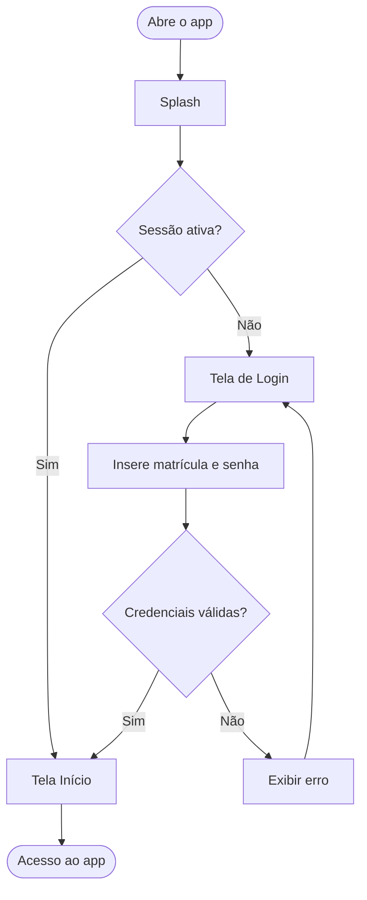
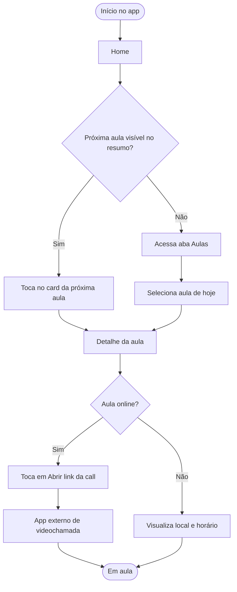
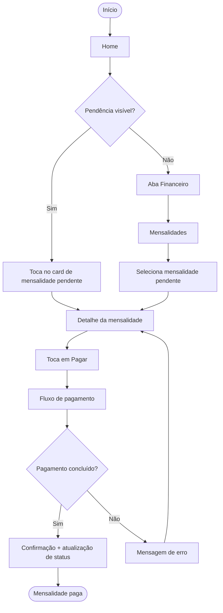
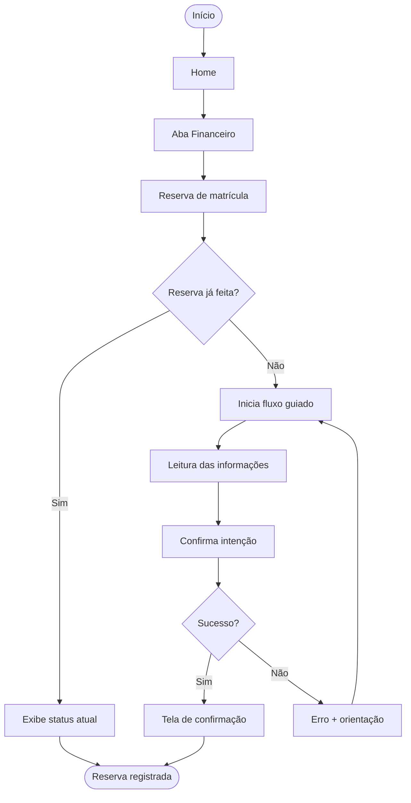
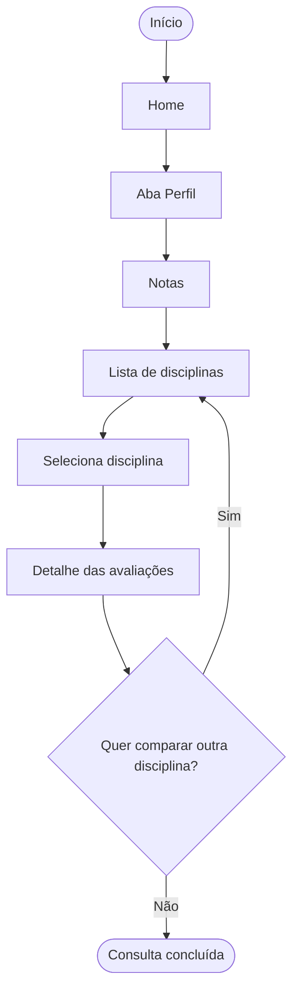
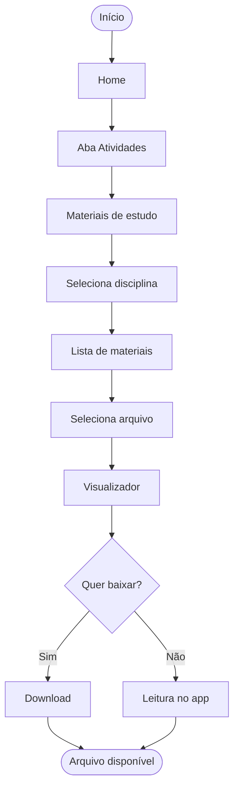
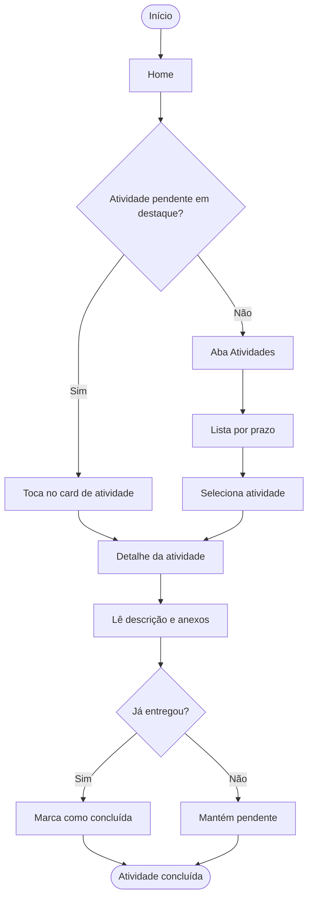
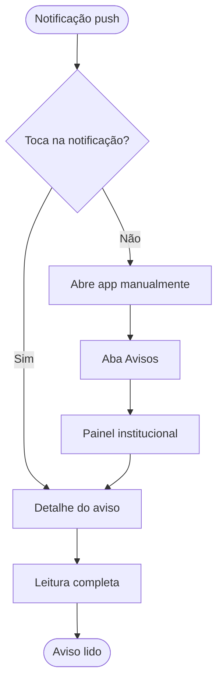
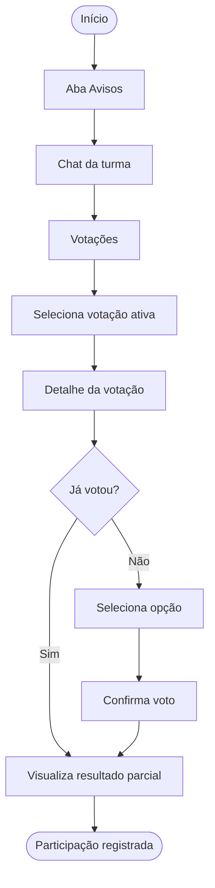

# User Flow

**Projeto:** Aplicativo Acadêmico SATC
**Entregável:** 02 — User Flow

---

## 1. Visão geral

Os fluxos abaixo representam os caminhos principais do estudante dentro do aplicativo, cobrindo as tarefas mais recorrentes descritas na jornada do usuário: entrada no app, consulta da rotina acadêmica, pagamento, reserva de matrícula, notas, materiais, comunicação e votação da turma.

Cada fluxo parte de uma intenção concreta do usuário e segue até a conclusão da ação ou entrega de informação.

---

## 2. Fluxo 0 — Entrada e autenticação

> **Nota:** caso encontre dificuldade para visualizar o diagrama diretamente pelo renderizador do GitHub, recomenda-se consultar a seção [Sobre os diagramas (Mermaid)](../../README.md#sobre-os-diagramas-mermaid) no README principal do projeto, que descreve como utilizar o [mermaid.live](https://mermaid.live) para uma navegação mais confortável.

---

## 3. Fluxo 1 — Consultar próxima aula e abrir call online

**Persona:** Estudante que quer saber qual é a próxima aula e entrar na call se for online.

> **Nota:** caso encontre dificuldade para visualizar o diagrama diretamente pelo renderizador do GitHub, recomenda-se consultar a seção [Sobre os diagramas (Mermaid)](../../README.md#sobre-os-diagramas-mermaid) no README principal do projeto, que descreve como utilizar o [mermaid.live](https://mermaid.live) para uma navegação mais confortável.

---

## 4. Fluxo 2 — Pagar mensalidade

**Persona:** Estudante com mensalidade próxima do vencimento.

> **Nota:** caso encontre dificuldade para visualizar o diagrama diretamente pelo renderizador do GitHub, recomenda-se consultar a seção [Sobre os diagramas (Mermaid)](../../README.md#sobre-os-diagramas-mermaid) no README principal do projeto, que descreve como utilizar o [mermaid.live](https://mermaid.live) para uma navegação mais confortável.

---

## 5. Fluxo 3 — Reservar matrícula

**Persona:** Estudante em período de rematrícula.

> **Nota:** caso encontre dificuldade para visualizar o diagrama diretamente pelo renderizador do GitHub, recomenda-se consultar a seção [Sobre os diagramas (Mermaid)](../../README.md#sobre-os-diagramas-mermaid) no README principal do projeto, que descreve como utilizar o [mermaid.live](https://mermaid.live) para uma navegação mais confortável.

---

## 6. Fluxo 4 — Consultar notas

**Persona:** Estudante que quer ver desempenho acadêmico.

> **Nota:** caso encontre dificuldade para visualizar o diagrama diretamente pelo renderizador do GitHub, recomenda-se consultar a seção [Sobre os diagramas (Mermaid)](../../README.md#sobre-os-diagramas-mermaid) no README principal do projeto, que descreve como utilizar o [mermaid.live](https://mermaid.live) para uma navegação mais confortável.

---

## 7. Fluxo 5 — Acessar material de estudo

**Persona:** Estudante que precisa de um PDF de aula.

> **Nota:** caso encontre dificuldade para visualizar o diagrama diretamente pelo renderizador do GitHub, recomenda-se consultar a seção [Sobre os diagramas (Mermaid)](../../README.md#sobre-os-diagramas-mermaid) no README principal do projeto, que descreve como utilizar o [mermaid.live](https://mermaid.live) para uma navegação mais confortável.

---

## 8. Fluxo 6 — Ver atividade pendente e marcar como concluída

**Persona:** Estudante que quer acompanhar tarefas.

> **Nota:** caso encontre dificuldade para visualizar o diagrama diretamente pelo renderizador do GitHub, recomenda-se consultar a seção [Sobre os diagramas (Mermaid)](../../README.md#sobre-os-diagramas-mermaid) no README principal do projeto, que descreve como utilizar o [mermaid.live](https://mermaid.live) para uma navegação mais confortável.

---

## 9. Fluxo 7 — Ler aviso institucional

**Persona:** Estudante notificado sobre aviso importante.

> **Nota:** caso encontre dificuldade para visualizar o diagrama diretamente pelo renderizador do GitHub, recomenda-se consultar a seção [Sobre os diagramas (Mermaid)](../../README.md#sobre-os-diagramas-mermaid) no README principal do projeto, que descreve como utilizar o [mermaid.live](https://mermaid.live) para uma navegação mais confortável.

---

## 10. Fluxo 8 — Participar de votação da turma

**Persona:** Estudante que quer votar em enquete da turma.

> **Nota:** caso encontre dificuldade para visualizar o diagrama diretamente pelo renderizador do GitHub, recomenda-se consultar a seção [Sobre os diagramas (Mermaid)](../../README.md#sobre-os-diagramas-mermaid) no README principal do projeto, que descreve como utilizar o [mermaid.live](https://mermaid.live) para uma navegação mais confortável.

---

## 11. Resumo dos fluxos

| # | Fluxo | Ponto de partida | Resultado esperado |
|---|---|---|---|
| 0 | Entrada e autenticação | Splash | Acesso à Home |
| 1 | Próxima aula / call online | Home | Entrou na aula |
| 2 | Pagar mensalidade | Home ou Financeiro | Pagamento confirmado |
| 3 | Reservar matrícula | Financeiro | Reserva registrada |
| 4 | Consultar notas | Perfil | Desempenho visualizado |
| 5 | Material de estudo | Atividades | Arquivo acessado |
| 6 | Atividade pendente | Home ou Atividades | Atividade concluída |
| 7 | Aviso institucional | Push ou Avisos | Aviso lido |
| 8 | Votação da turma | Avisos | Voto registrado |

---

## 12. Princípios aplicados aos fluxos

- **Caminhos redundantes**: ações críticas (mensalidade, aula, atividade) podem ser iniciadas pela Home ou pela aba correspondente.
- **Baixo número de passos** até a ação principal — máximo de 4 toques do login até qualquer tarefa de alta prioridade.
- **Confirmação visual** em toda ação que altere estado (pagamento, reserva, voto, conclusão).
- **Tratamento de erro** explícito em fluxos sensíveis (login, pagamento, reserva).
- **Entrada por notificação** considerada como ponto alternativo de início para avisos e aulas online.
